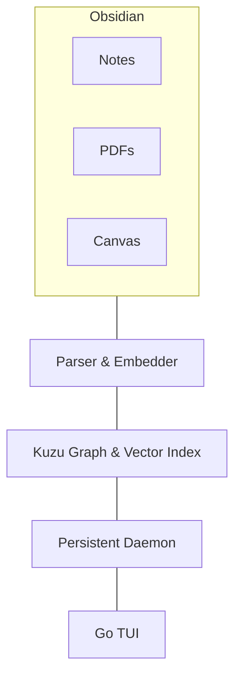

# Local RAG

A lightweight, fully local Retrieval-Augmented Generation (RAG) system designed for CPU-only hardware. It combines graph relationships and vector search to query Markdown notes, Obsidian Canvas files, and PDFs with minimal memory overhead.

## Features

- Fully local inference with `llama.cpp`
- Hybrid graph + vector retrieval using KùzuDB
- Persistent background daemon for fast responses
- Lightweight Go TUI client
- Supports:
  - Markdown (`.md`)
  - Obsidian Canvas (`.canvas`)
  - PDF (`.pdf`)

## Stack

- **LLM:** Qwen (GGUF, 4-bit)
- **Inference:** `llama.cpp`
- **Embeddings:** `all-MiniLM-L6-v2`
- **Database:** KùzuDB (Graph + HNSW Vector Index)
- **Backend:** Python
- **Frontend:** Go TUI

## Architecture

## Pipeline

1. Parse Markdown, Canvas, and PDF files.
2. Generate embeddings and graph relationships.
3. Store everything in KùzuDB.
4. Query through the Go TUI.
5. Retrieve relevant graph/vector context.
6. Generate a response with Qwen.

## Goals

- Local-first
- CPU-friendly
- Low memory usage
- Fast startup
- Obsidian-centric knowledge retrieval
