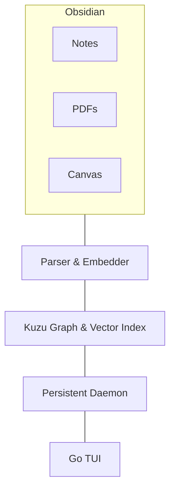

# Local RAG

A lightweight, fully local Retrieval-Augmented Generation (RAG) system designed for CPU-only hardware. It combines graph relationships and vector search to query Markdown notes, Obsidian Canvas files, and PDFs with minimal memory overhead.

## Features

- Fully local inference with `llama.cpp`
- Hybrid graph + vector retrieval using KùzuDB
- Persistent background daemon for fast responses
- Lightweight Go TUI client
- Supports:
  - Markdown (`.md`)
  - Obsidian Canvas (`.canvas`)
  - PDF (`.pdf`)

## Stack

- **LLM:** Qwen (GGUF, 4-bit)
- **Inference:** `llama.cpp`
- **Embeddings:** `all-MiniLM-L6-v2`
- **Database:** KùzuDB (Graph + HNSW Vector Index)
- **Backend:** Python
- **Frontend:** Go TUI

## Architecture



## Pipeline

1. Parse Markdown, Canvas, and PDF files.
2. Generate embeddings and graph relationships.
3. Store everything in KùzuDB.
4. Query through the Go TUI.
5. Retrieve relevant graph/vector context.
6. Generate a response with Qwen.

## Goals

- Local-first
- CPU-friendly
- Low memory usage
- Fast startup
- Obsidian-centric knowledge retrieval

## Setup:
0. **Prerequisites**
    - have git installed `sudo pacman -S git`
    - have uv installed  `sudo pacman -S python-uv`
1. **clone the repository**
    ```bash
    git pull https://github.com/ronik-dev/obsidian-rag
    ```
2. **Download python dependencies**
    ```bash
    cd obsidian-rag/backend
    uv sync
    ```
3. **Download the model**
    ```bash
    uv run hf download Qwen/Qwen2.5-1.5B-Instruct-GGUF qwen2.5-1.5b-instruct-q5_k_m.gguf --local-dir ./models
    ```
4. **Configure env variables and systemd service**
    - compile a `.env` file based on `.env.example`
    - compile a `systemd/rag-daemon.service` based on `systemd/rag-daemon.service.example`  
      copy the new `systemd/rag-daemon.service` to your user `.config/systemd/`

5. **Create Kùzu db schema**
    ```bash
    uv run schema.py
    ```
    expected output: 
    ```text 
    INFO:root:Connecting to KùzuDB at ../data/vault.db
    INFO:root:Creating node tables...
    INFO:root:Success: CREATE NODE TABLE Folder
    INFO:root:Success: CREATE NODE TABLE Document
    INFO:root:Success: CREATE NODE TABLE Chunk
    INFO:root:Creating Relationship Tables...
    INFO:root:Success: CREATE REL TABLE CONTAINS
    INFO:root:Success: CREATE REL TABLE PART_OF
    INFO:root:Success: CREATE REL TABLE LINKS_TO
    INFO:root:Schema initialization complete!
    ```
6. **Ingest your Vault**
    Run the ingestion script to parse your Markdown files, generate embeddings, and build the KùzuDB graph.
    ```bash
    uv run ingest.py
    ```
    *Note: The first time you run this, it will download the `all-MiniLM-L6-v2` embedding model. Subsequent runs will only process changed or new files.*
    Optionally inspect the injection with 
    ```bash
    uv run sanity-check.py
    ```
    output values should be non 0 for a non empty vault:
    ```text
    $ uv run sanity-check.py
    --- Database Counts ---
    Documents:  <some number>
    Chunks:     <some number>
    PART_OF:    <some number>
    ```
7. **Compile link and start the Background Daemon**
    - Create and compile a `systemd/rag-daemon.service` based on `systemd/rag-daemon.service`
    - Enable and start the systemd service so the daemon runs silently in the background.
        ```bash
        cd ..
        ln -s $(pwd)/systemd/rag-daemon.service ~/.config/systemd/user/rag-daemon.service
        systemctl --user daemon-reload
        systemctl --user enable --now rag-daemon.service
        ```
    - Check the logs to ensure it started correctly and the models are loaded:
        ```bash
        journalctl --user -fu rag-daemon.service
        ```
8. **Test the API (Optional)**
    Verify the daemon is responding to queries before setting up the frontend:
    ```bash
    curl -X POST [http://127.0.0.1:8000/query](http://127.0.0.1:8000/query) \
         -H "Content-Type: application/json" \
         -d '{"query": "Summarize my recent project notes."}'
    ```
9. **Build and Run the Go TUI**
    Navigate to the frontend directory, download the Bubble Tea dependencies, and run the client.
    ```bash
    cd ../frontend
    go mod tidy
    go run main.go
    ```
